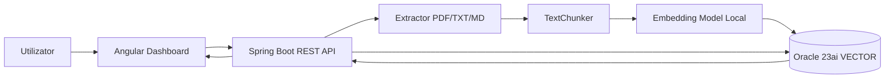
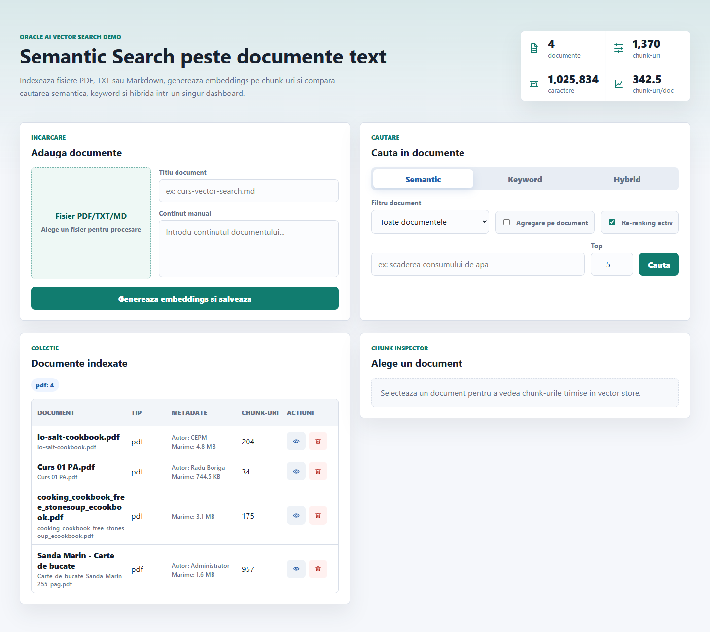
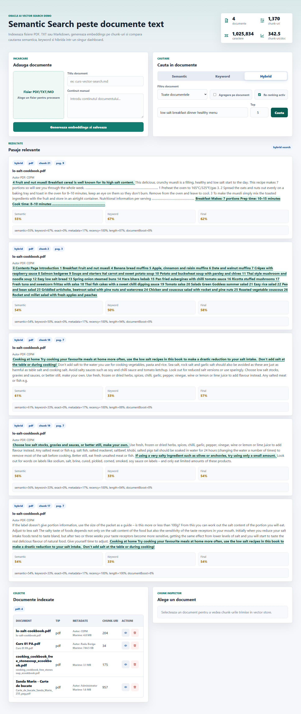

# Semantic Search peste documente text

Aplicație demonstrativă pentru căutare semantică într-un set de documente text folosind embeddings și Oracle AI Vector Search.

Proiectul permite încărcarea de fișiere PDF, TXT și Markdown, extrage textul, îl împarte în chunk-uri, generează embeddings local pentru fiecare chunk și salvează vectorii în Oracle Database Free 23ai. Interfața Angular permite compararea căutării semantice cu cea keyword și cu o variantă hibridă, plus inspectarea chunk-urilor și a scorurilor de ranking.

## Cuprins

- [Funcționalități implementate](#functionalitati-implementate)
- [Arhitectură](#arhitectura)
- [Model de date](#model-de-date)
- [Flux de procesare](#flux-de-procesare)
- [Căutare semantică, keyword și hibridă](#cautare-semantica-keyword-si-hibrida)
- [Re-ranking local](#re-ranking-local)
- [Configurare și rulare](#configurare-si-rulare)
- [Endpoint-uri API](#endpoint-uri-api)
- [Dovezi de rulare](#dovezi-de-rulare)
- [Scenariu demo](#scenariu-demo)
- [Slide-uri prezentare](#slide-uri-prezentare)
- [Limitări și posibile extinderi](#limitari-si-posibile-extinderi)
- [Referințe](#referinte)

## Funcționalități Implementate

- Upload pentru documente `.pdf`, `.txt`, `.md` și text introdus manual.
- Extracție text PDF cu Apache PDFBox, pagină cu pagină.
- Normalizare pentru caractere românești extrase greșit din unele PDF-uri vechi.
- Salvare metadate document: nume fișier, tip sursă, dată încărcare, titlu PDF, autor PDF, dimensiune fișier.
- Salvare metadate chunk: index chunk, număr pagină PDF, conținut, embedding vectorial.
- Chunking cu overlap și tăiere la granițe naturale de propoziție/cuvânt.
- Embeddings generate local cu `AllMiniLmL6V2EmbeddingModel`, fără API extern.
- Stocare vectorială în Oracle folosind tipul `VECTOR(384, FLOAT32)`.
- Căutare semantică prin `VECTOR_DISTANCE(..., COSINE)`.
- Căutare keyword cu potrivire text în `CLOB`.
- Căutare hibridă care combină rezultate semantice și keyword.
- Re-ranking local, fără modele externe.
- Scoruri afișate separat: semantic, keyword și final.
- Explicație ranking pentru fiecare rezultat.
- Highlight semantic al fragmentelor relevante.
- Filtru pe document.
- Agregare rezultate pe document.
- Istoric vizual al corpusului prin statistici: documente, chunk-uri, caractere, medie chunk-uri/document.
- Listare documente indexate, inspectare chunk-uri și ștergere documente.

## Arhitectură



Structura principală a repository-ului:

```text
SemanticSearchTPBDTS/
  backend/
    sql/init_oracle_vector_db.ps1
    src/main/java/com/project/semanticsearch/
      config/       configurare model embeddings
      controller/   REST API + tratare erori
      dto/          obiecte de răspuns pentru frontend
      model/        entități JPA documents/document_chunks
      repository/   query-uri JPA și Oracle Vector Search
      service/      extracție, chunking, embeddings, search, ranking
  frontend/
    src/app/
      components/search/  dashboard Angular
      models/             tipuri TypeScript
      services/           client HTTP
  docs/
    assets/               capturi de ecran pentru documentație
    DEMO_SCENARIU_10_MIN.md
```

Backend-ul expune un API REST pe `http://localhost:8081`, iar frontend-ul rulează pe `http://localhost:4200`.

## Model De Date

Baza de date are două tabele principale:

```sql
CREATE TABLE documents (
    id NUMBER GENERATED BY DEFAULT AS IDENTITY PRIMARY KEY,
    file_name VARCHAR2(300) NOT NULL,
    source_type VARCHAR2(30) DEFAULT 'manual' NOT NULL,
    uploaded_at TIMESTAMP DEFAULT SYSTIMESTAMP NOT NULL,
    pdf_title VARCHAR2(500),
    pdf_author VARCHAR2(300),
    file_size_bytes NUMBER,
    CONSTRAINT chk_documents_source_type
        CHECK (source_type IN ('pdf', 'txt', 'md', 'manual'))
);

CREATE TABLE document_chunks (
    id NUMBER GENERATED BY DEFAULT AS IDENTITY PRIMARY KEY,
    document_id NUMBER NOT NULL,
    chunk_index NUMBER NOT NULL,
    page_number NUMBER,
    content CLOB NOT NULL,
    embedding VECTOR(384, FLOAT32),
    CONSTRAINT fk_document_chunks_document
        FOREIGN KEY (document_id)
        REFERENCES documents(id)
        ON DELETE CASCADE,
    CONSTRAINT uq_document_chunk_index UNIQUE (document_id, chunk_index)
);
```

Relația este `documents 1 - N document_chunks`. Ștergerea unui document șterge automat și chunk-urile asociate.

### Metadate Salvate

Pentru fiecare document:

- `file_name`: numele fișierului încărcat.
- `source_type`: `pdf`, `txt`, `md` sau `manual`.
- `uploaded_at`: momentul încărcării.
- `pdf_title`: titlul extras din metadata PDF, dacă există.
- `pdf_author`: autorul extras din metadata PDF, dacă există.
- `file_size_bytes`: dimensiunea fișierului.

Pentru fiecare chunk:

- `document_id`: documentul sursă.
- `chunk_index`: poziția chunk-ului în document.
- `page_number`: pagina PDF din care provine chunk-ul.
- `content`: textul chunk-ului.
- `embedding`: vectorul numeric folosit la căutarea semantică.

## Flux De Procesare

1. Utilizatorul încarcă un fișier sau introduce text manual.
2. Backend-ul detectează tipul sursei.
3. Pentru PDF, textul este extras pe pagini cu PDFBox.
4. Textul este normalizat și curățat.
5. `TextChunker` împarte textul în bucăți de aproximativ 900 de caractere, cu overlap de 160 de caractere.
6. Pentru fiecare chunk se generează embedding local.
7. Documentul, chunk-urile, metadatele și vectorii sunt salvați în Oracle.
8. La căutare, query-ul utilizatorului este transformat într-un embedding.
9. Oracle calculează distanța cosine între embedding-ul query-ului și embeddings-urile chunk-urilor.
10. Rezultatele sunt reordonate local și afișate în UI.

Chunk-urile nu sunt perfect egale deoarece algoritmul preferă să taie la final de propoziție sau la graniță de cuvânt. Această alegere face fragmentele mai ușor de citit și reduce cazurile în care un chunk începe în mijlocul unui cuvânt.

## Căutare Semantică, Keyword Și Hibridă

### Căutare Semantică

Căutarea semantică folosește embedding-ul query-ului și `VECTOR_DISTANCE` din Oracle:

```java
ORDER BY VECTOR_DISTANCE(dc.embedding, TO_VECTOR(:searchVector), COSINE)
FETCH FIRST :resultLimit ROWS ONLY
```

Avantajul este că poate găsi pasaje apropiate ca sens chiar dacă nu conțin exact aceleași cuvinte ca întrebarea.

### Căutare Keyword

Căutarea keyword caută apariția query-ului în text:

```sql
WHERE DBMS_LOB.INSTR(LOWER(dc.content), LOWER(:query)) > 0
```

Avantajul este simplitatea și interpretabilitatea. Dezavantajul este că ratează sinonime, reformulări și întrebări naturale.

### Căutare Hibridă

Căutarea hibridă combină candidații din semantic search și keyword search. Dacă același chunk apare în ambele liste, scorurile se combină. Modul hibrid este util în demo deoarece arată diferența dintre potrivire textuală și similaritate de sens.

## Re-Ranking Local

Re-ranking-ul este opțional și nu folosește modele externe. După ce sunt colectați candidații, aplicația calculează un scor final din mai mulți factori:

- `semanticScore`: similaritatea vectorială.
- `keywordScore`: câți termeni din query apar în fragment.
- `exactPhraseScore`: dacă expresia completă apare exact în fragment.
- `metadataScore`: potrivire în nume fișier, titlu PDF sau autor.
- `recencyScore`: bonus pentru documente încărcate recent.
- `lengthScore`: preferă chunk-uri apropiate de dimensiunea țintă.
- `documentBoost`: bonus când același document are mai multe potriviri.

Pentru fiecare rezultat, UI afișează scorurile și explicația ranking-ului, de exemplu:

```text
semantic=55%, keyword=67%, exact=0%, metadata=17%, recency=100%, length=87%, documentBoost=8%
```

## Configurare Și Rulare

### Cerințe Software

- Docker Desktop.
- Oracle Database Free 23ai în container.
- Java 17 sau mai nou.
- Maven Wrapper inclus în proiect.
- Node.js și npm.
- Angular CLI prin dependențele proiectului.

Versiuni folosite în proiect:

- Spring Boot `4.0.4`.
- Oracle JDBC `ojdbc11`.
- Apache PDFBox `3.0.4`.
- LangChain4j Spring Boot Starter `0.36.2`.
- `langchain4j-embeddings-all-minilm-l6-v2:1.12.2-beta22`.
- Angular `17`.
- RxJS `7.8`.
- TypeScript `5.2`.

### Pornire Oracle

Containerul folosit pentru demo:

```powershell
docker run -d `
  -p 1521:1521 `
  -p 8080:8080 `
  -e ORACLE_PWD=ParolaProiect123# `
  -v oracle_data:/opt/oracle/oradata `
  --name oracle-vector-db `
  container-registry.oracle.com/database/free:latest
```

### Inițializare Bază De Date

Scriptul unic pentru inițializarea bazei:

```powershell
.\backend\sql\init_oracle_vector_db.ps1
```

Scriptul:

- verifică dacă rulează containerul `oracle-vector-db`;
- așteaptă disponibilitatea serviciului `FREEPDB1`;
- creează sau reactivează userul `proiect_ai`;
- creează tabelele `documents` și `document_chunks`;
- creează indexurile necesare;
- afișează configurația JDBC pentru backend.

### Pornire Backend

```powershell
cd backend
.\mvnw.cmd spring-boot:run
```

Backend:

```text
http://localhost:8081
```

### Pornire Frontend

```powershell
cd frontend
npm install
npm start
```

Frontend:

```text
http://localhost:4200
```

## Endpoint-uri API

Upload text manual:

```http
POST /api/documents/upload?fileName=note-curs.txt
Content-Type: text/plain
```

Upload JSON:

```http
POST /api/documents/upload-json
Content-Type: application/json
```

Upload fișier:

```http
POST /api/documents/upload-file
Content-Type: multipart/form-data
```

Căutare pe chunk-uri:

```http
GET /api/documents/search?query=low%20salt%20breakfast&mode=semantic&limit=5
GET /api/documents/search?query=low%20salt%20breakfast&mode=keyword&limit=5
GET /api/documents/search?query=low%20salt%20breakfast&mode=hybrid&limit=5
GET /api/documents/search?query=low%20salt%20breakfast&mode=hybrid&limit=5&documentId=1&rerank=true
```

Căutare agregată pe document:

```http
GET /api/documents/search/documents?query=low%20salt%20breakfast&mode=hybrid&limit=5
```

Dashboard:

```http
GET /api/documents/stats
GET /api/documents
GET /api/documents/{documentId}/chunks
DELETE /api/documents/{documentId}
```

## Dovezi De Rulare

Dashboard cu documente PDF indexate și statistici corpus:



Exemplu de căutare hibridă cu scoruri, highlight semantic și explicație de ranking:



În rularea locală folosită pentru capturi, API-ul `/api/documents/stats` a raportat:

```json
{
  "documentCount": 4,
  "chunkCount": 1370,
  "totalCharacters": 1025834,
  "averageChunksPerDocument": 342.5,
  "sourceTypeCounts": {
    "pdf": 4
  }
}
```

## Scenariu Demo

Scenariul complet pentru prezentarea de 10 minute este în:

[docs/DEMO_SCENARIU_10_MIN.md](docs/DEMO_SCENARIU_10_MIN.md)

Pe scurt, demo-ul urmărește:

1. prezentarea problemei;
2. încărcarea/indexarea documentelor;
3. inspectarea chunk-urilor și metadatelor;
4. compararea semantic vs keyword;
5. rularea căutării hibride;
6. activarea/dezactivarea re-ranking-ului;
7. filtrarea pe document și agregarea pe document;
8. interpretarea scorurilor și a rezultatelor.

## Slide-uri Prezentare

Deck-ul de 2 slide-uri pentru introducerea proiectului este în:

[docs/slides/semantic-search-demo/output.pptx](docs/slides/semantic-search-demo/output.pptx)

## Limitări Și Posibile Extinderi

Limitări:

- Nu există autentificare sau roluri.
- Pentru PDF-uri scanate este necesar OCR; PDFBox extrage doar text digital.
- Modelul de embeddings este local și mic, bun pentru demo, dar mai slab decât modele comerciale mari.
- Highlight-ul semantic presupune embeddings suplimentare pe propoziții, deci poate crește timpul de răspuns.
- Nu există index vectorial ANN explicit creat după popularea corpusului; pentru volume mari se poate adăuga un `VECTOR INDEX`.

Extinderi:

- Adăugare OCR pentru PDF-uri scanate.
- Index vectorial Oracle pentru corpusuri mari.
- Paginare și cache pentru rezultate.
- Suport pentru DOCX/HTML.
- Export rezultate în CSV/PDF.
- Re-ranking mai avansat cu reguli de proximitate între termeni.
- Evaluare cu set de întrebări și metrici de relevanță.
- Transformare în RAG simplificat prin adăugarea unui generator de răspuns.

## Referințe

- Oracle Database 23ai AI Vector Search User's Guide, https://docs.oracle.com/en/database/oracle/oracle-database/23/vecse/
- Oracle Database SQL Language Reference: `VECTOR`, `VECTOR_DISTANCE`, https://docs.oracle.com/en/database/oracle/oracle-database/23/sqlrf/
- Apache PDFBox Documentation, https://pdfbox.apache.org/
- LangChain4j Documentation, https://docs.langchain4j.dev/
- Reimers, N. and Gurevych, I. 2019. Sentence-BERT: Sentence Embeddings using Siamese BERT-Networks. https://arxiv.org/abs/1908.10084
